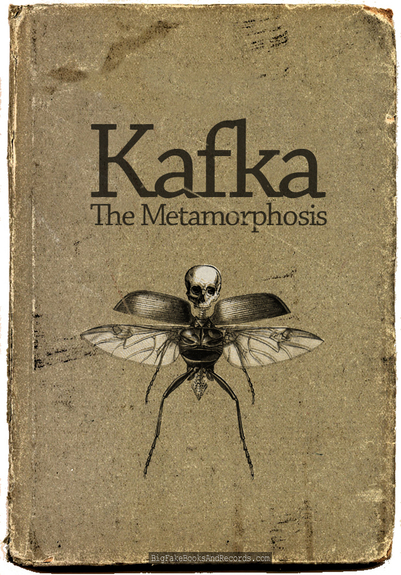

# Пример взаимодействия сервер клиента через Kafka


## Общие сведения


Простой пример работы с Apache Kafka, Подписанием JSON обьекта RSA ключом.
Состоит из модулей клиент-сервер.
Работает следующим образом:
- Пользователь отправляет серверу REST запрос, содержащий модель Employee (взят из воздуха и беcсмысленный ~~как и моя жизнь~~)
- Сервер получает данное сообщение, подписывает ее RSA ключем и отправляет ее дальше на Kafka.
- Kafka перессылает сообщение всем подписчикам
- Клиенты (то бишь подписчики) получают сообщение, расшифровывают ее, и печатает в консоль

## Как собрать
в консоли набрать 
```bash
mvn package
```

## Как запустить
1. Скачать и запустить Apache Kafka
2. Запустить сервер (Сервер оформлен в виде embedded файла, то есть standalone JAR файл чтобы не париться с деплоем).
3. Запустить n клиентов (Обычные Jar файлы)
4. Браузером постучаться на адрес: http://localhost:8080/entry - это даст ~~ачивку "Эксперт по бессмысленной трете жизни"~~ пример JSON обьекта, которую можно дальше отправить
5. Отправить POST запрос на адрес выше. В теле указать ранее полученный JSON обьект
6. Посмотреть консоль клиентов

## Как настроить
Все настройки свалены в одну кучу, в файл: application.properties. Лежит в модуле common

## Примечание
Данный пример написан за один вечер, без соблюдения каких либо правил и общепринятых решений. При чтений данного кода возмно Вам захочется посмотреть на меня с болью и глубокой скорбью.

## TODO
- Написать тесты
- Использовать IoC библиотеку
- Заменить JSON на другой обьект. Avro?
